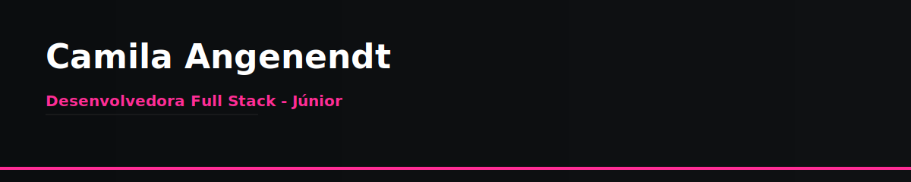

# Camila Angenendt 👋

Olá! Eu sou a Camila. Bem-vindo(a) ao meu perfil profissional no GitHub. Aqui você encontra meus projetos, tecnologias que uso e formas de contato.

  
  
  

---

## 🛠️ Linguagens e Tecnologias

  
  
  
  
  
  
  
  
  
  

---

## 📂 Projetos em Destaque

- [Buscador-de-repositórios-GitHub](https://github.com/camilaangenendt03-netizen/Buscador-de-reposit-rios-GitHub) — Uma aplicação web para buscar e listar repositórios do GitHub usando a API oficial do GitHub.
- [chess-streamers](https://github.com/camilaangenendt03-netizen/chess-streamers) — Projeto Chess Streamers Hub (CSS; interface e layout para listar/mostrar streamers de xadrez).
- [portal-teach-afiliados](https://github.com/camilaangenendt03-netizen/portal-teach-afiliados) — Projeto criado para fins de estudo e prática de React + Vite (TypeScript).

---

## 📊 Estatísticas

  
  

---

## 📬 Contato

- **Email:** camila_angenendt@hotmail.com
- **LinkedIn:** https://www.linkedin.com/in/camila-dami%C3%A3o-angenendt-131b47161
- **GitHub:** https://github.com/camilaangenendt03-netizen

---

**Obrigado por visitar meu perfil! 😊**
